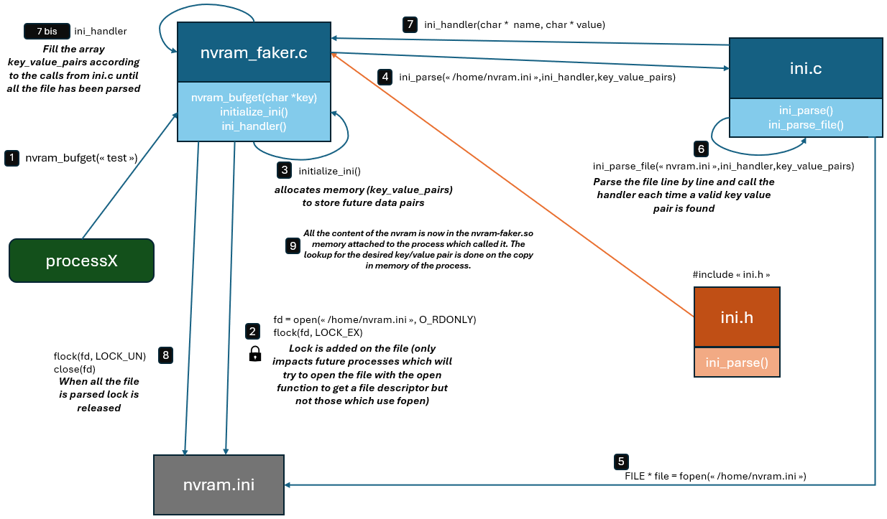
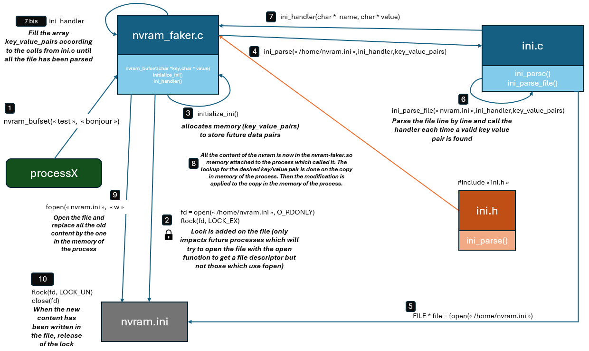

nvram-faker for DCS-932 to DCS-934
===========

CREDITS
-------------------------
This project is entirely based on the great work of Zachary Cutlip or [zcutlip](https://github.com/zcutlip) and Decidedly Gray or [decidedlygray](https://github.com/decidedlygray).

You can find the original project at this location : [nvram-faker](https://github.com/zcutlip/nvram-faker)

DETAILS
-------------------------

For the general description of the project and the global working we let you find the original README redacted by the authors [README](https://github.com/zcutlip/nvram-faker/blob/master/README.md) 

Here is what we added to the original code for the purpose of our project.  
We worked on the emulation of DCS-932 to DCS-934 D-Link cameras and we customed the original project to fit the nvram working of these elements.   

1. In our case, the emulation is a system emulation, thus all the processes need to access the same nvram. To implement the shared memory we used the a classical ini file as provided by the original project. But we added the "shared" part of the memory. The original project didn't managed the concurrential access to the nvram. Here we used the flock C function to allow concurrential access to the nvram. Each process has a copy in its memory and refresh it each time needed. We used the simplest way to implement shared memory. The goal for us to design such a simple shared memory management was to be sure that it would work on all filesystems and restricted kernels.

2. We added the multi line values in the ini file. It is now possible two have multi line values in your nvram which has been very useful in our cases with the emulated devices. (multiline values were already handled by the ini parser but not by the nvram-faker project)

3. We added some other functions just for our emulation to work but they just do nothing. 

4. The directory tests gathered some easy tests we used at the beginning to check if the concurrential access was working. 

IMPLEMENTATION
-------------------------
Below you can find two schemas which both describe the way of working of the shared memory management in both cases with nvram_bufset and nvram_bufget. 

**nvram_bufget :** 
   

**nvram_bufset :**  
  

